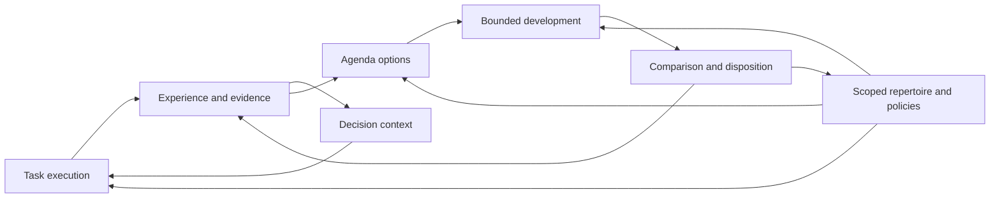

# Cognitive design checkpoint and implementation dependencies

Updated 2026-09-12 following worker `5864740`. The [final assessment](../../reviews/COGNITIVE-BATCH-02-FINAL-ASSESSMENT.md) accepts the real-repair and advisory-treatment results at their actual scope, with non-promising decisions robust to the refusal-accounting correction. It begins stage 9 synthesis while keeping stage 8.6 executable coordination acquisition open: the current retained product is prompt advice. The human subsequently requested a substantial executable design and an informative larger study. [Coordination 02](EXECUTABLE-COORDINATION-02.md) selects learned decision programs that request probes, instantiate actual ownership and choose bounded rework, enforced by existing runtime mechanisms. [The combined worker task](../../WORKER-EXECUTABLE-COORDINATION-02.md) includes historical delivery closure plus this new implementation, live acquisition, four-arm comparison and transfer. Historical Team 01 panels remain unchanged. General learner revision remains deferred; the preceding assessments below are historical context.

The bounded source inspection followed `run_experiment` into `run_panel(mode="retained")`, `bind_retention`, the executed B procedure and selected C composition, then subsequent-use loading. The behavior-changing and cosmetic controls in `tests/test_rpr13_endtoend.py` test the intended distinction. This pass did not rerun the worker's real-PostgreSQL tests or a live campaign. Their reported evidence is useful but has that provenance. No broad bug hunt was performed.

The implementation connects scaffolded acquisition: A interprets a closed-vocabulary directive, B executes a selector over existing reducers, and C uses retained compositions. This does not demonstrate unrestricted algorithm invention or useful model-acquired transfer. The historical authored-fixture negative remains valid only for its own treatment.

## What should accumulate

The intended persistent intelligence is a growing repertoire of useful distinctions, computations, instruments and ways to investigate, together with evidence about where they work. A temporary worker is one execution of that repertoire. Model inference proposes new possibilities; checked use decides which become dependable options for future work.

The difference from merely retaining instructions is observable: a later worker can perform a previously unavailable computation, distinguish cases it previously conflated, run a newly constructed measurement, select a better method or make a better next-investigation decision. Text remains useful inside this system. A new artifact format does not establish any of those changes by itself.

Authority, resource accounting and recovery constrain every execution in this diagram. They are existing substrate responsibilities, not another cognitive loop. Rejected development can still update scoped evidence and the frontier without changing the released repertoire.

## Selected semantics, still awaiting evidence

| Part | What may change durably | What must be checked | Design |
|---|---|---|---|
| Memory/context | The evidence and computations made available for a decision | Delivery, interpretation, relevant opposition, freshness and downstream use | [Memory and context](MEMORY-AND-CONTEXT.md) |
| Agenda/background work | Which question is investigated and why it is continued or stopped | Shared authority rules, informative continuation, total cost and later outcomes | [Agenda protocol and records](AGENDA-EXPERIMENT-01.md) |
| Representation/transfer | The objects and operations available for solving a family of tasks | Fidelity, coverage, constructibility, source-domain results and reuse cost | [Representation and transfer](REPRESENTATION-AND-TRANSFER.md) |
| Teams | How obligations, information and artifacts are distributed and combined | Valid joins, dependency compatibility, correlated errors and total coordination cost | [Temporary teams](TEMPORARY-TEAMS.md) |
| Learner revision/consolidation | How future changes are proposed, evaluated and retained | Complete learning trajectories, old competence, evaluation meaning and migration | [Learner revision](LEARNER-REVISION.md) |

These responsibilities reuse the same investigations, artifact identities, capability/composition machinery, evidence and allocations. They do not prescribe five new services, a universal ontology, a vector store, a permanent hierarchy or an extra workflow engine. Exact database/API mapping remains an engineering decision after audited interfaces are available.

## Decisions that independent reasoning can support now

- A representation must state which distinctions and source obligations it preserves; coverage and usefulness remain separate from soundness.
- A team needs a composition rule connecting its partial results to the parent obligation; participant count and agreement cannot replace it.
- A learner must be compared by the development it produces, not simply the performance of one solver it happened to produce.
- Dormancy, retirement, archival and deletion have different consequences for work, eligibility and evidence.
- A comparison needs shared authority rules and an honest strong baseline. Richer architecture is a hypothesis, not the success condition.

The [primary-source research notes](COGNITIVE-RESEARCH-NOTES.md) provide precedents and counterpressure for these choices. They do not establish novelty or a globally optimal combined design. The new drafts resolve first semantic choices; quantitative policies remain testable rather than assumed optimal.

## What now needs implementation results

| Missing evidence | Decisions it unlocks | What does not have to wait for it |
|---|---|---|
| Interpretable live solver-to-grader path, preserved raw outcomes and failure classification | Credible acquisition/transfer task family and positive/negative controls | Abstract representation obligations and source-domain counterexamples |
| Effective configuration, operation union, cost/usage and held-liability reconciliation | Live study budgets, candidate counts, reuse horizons and fair resource comparisons | Qualitative estimands and explicit accounting boundaries |
| Actual packet delivery, dependencies and current-state checks | Minimal agenda/team input contracts and reliable cross-attempt evidence use | Policy-level selection and continuation hypotheses |
| Audited composition, ownership, stop/recovery and reservation interfaces | Concrete team/agenda commands, durable mappings and fault fixtures | Work-graph, join and unresolved-effect semantics |
| Release selection, fresh-process use and preserved interpretation versions | Transfer/consolidation/migration implementation and longitudinal study setup | Distinction between retained artifacts, selected use and learning benefit |
| Usable corpus and observed development bottlenecks | Which abstraction or learner-policy intervention is worth constructing first | The permissible invention/revision space and rejecting study structure |

An interim worker evidence packet covering the relevant row can unblock a decision; every unrelated deployment qualification need not finish first. Conversely, a large passing test count without the relevant behavioral evidence does not answer these questions.

## Current decisions and evidence boundary

The existing node algebra already expresses bounded sequences, alternatives, dependency joins and suspension. Team 01 adds explicit obligations, owned artifact submissions and executable integration at that boundary. It must not duplicate the scheduler. A local dependency barrier does not establish that combined code satisfies a parent task.

We can now select the organization, template meaning, comparison arms and rejecting controls without another worker round. We cannot select an optimal team size, a learned routing rule, a worthwhile learner intervention or a credible reuse horizon from source inspection alone. These require actual trajectories and costs.

A retained coordination template is an experimental versioned composition that binds to new inputs. Its first transfer comparison keeps the rest of the policy fixed. This gives stage 8.7 a possible input corpus without pretending that template retention already improves the learner itself. Background consolidation remains a bounded development job selected by the agenda, not an additional heartbeat subsystem.

## Resume order

1. The worker implements Team 01 through one complete public path and validates its task oracle independently.
2. Development calibrates the model/tool envelope and produces at most one experimental template, or an explicit no-candidate result. Freeze before protected comparison.
3. Complete live S/P/T evaluation and cold/warm/S transfer under the finite grant, including the live development-derived template or its measured no-candidate fallback. The independent representation lane completes the outstanding live acquisition/use campaign. An observed external blocker is reported promptly and leaves the affected obligation open; earlier no-gateway reports are not current evidence.
4. Interpret mechanisms, task gains, retained gains and costs separately. A valid negative closes an experiment and may favor the simpler policy.
5. Choose one learner intervention only from an observed recurring bottleneck. Consolidate the combined evidence at stage 9 before expanding organization or revisiting the stack.

## Task list at this checkpoint

- [x] Accept the central acquired-artifact connection at its inspected/reported scope.
- [x] Refine temporary teams into a bounded executable contract, including a persistent coordination product.
- [x] Preserve strong single-worker and simple parallel alternatives, with independent whole-task measurement.
- [x] Use primary research as a reference and explicit counterpressure on novelty and superiority claims.
- [x] Write the next worker packet with isolated ownership and two focused integration reviews.
- [ ] Worker implements, calibrates, freezes and supplies connected behavioral evidence.
- [ ] Interpret the live representation result and Team 01 results.
- [ ] Select the learner intervention and perform architecture consolidation.

This is the next evidence boundary. Another abstract layer would not decide whether these plans help or whether the model can acquire a reusable one. Implementation and bounded experiments are now the productive next work. Operational qualification remains separate; tests with local fixtures do not validate real containment, provider billing or other unsupported deployment conditions.
