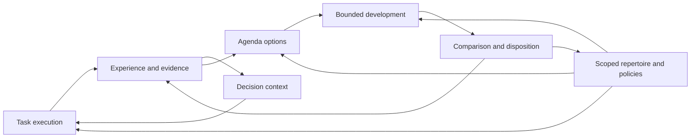

# Cognitive design checkpoint and implementation dependencies

Updated 2026-09-11. The original independent design pass produced stage 8.4–8.7 policy/semantic drafts. Subsequent engineering closure enabled Agenda 01, whose working prototype now has three bounded acceptance gates. The latest [combined worker assignment](../../WORKER-COGNITIVE-BATCH-01.md) commissions those gates plus [Representation 01](REPRESENTATION-01-IMPLEMENTATION.md). Representation construction/transfer is specified but not yet implemented or empirically validated. Team and learner-revision drafts remain outside this implementation batch.

## What should accumulate

The intended persistent intelligence is a growing repertoire of useful distinctions, computations, instruments and ways to investigate, together with evidence about where they work. A temporary worker is one execution of that repertoire. Model inference proposes new possibilities; checked use decides which become dependable options for future work.

The difference from merely retaining instructions is observable: a later worker can perform a previously unavailable computation, distinguish cases it previously conflated, run a newly constructed measurement, select a better method or make a better next-investigation decision. Text remains useful inside this system. A new artifact format does not establish any of those changes by itself.

Authority, resource accounting and recovery constrain every execution in this diagram. They are existing substrate responsibilities, not another cognitive loop. Rejected development can still update scoped evidence and the frontier without changing the released repertoire.

## Selected semantics, still awaiting evidence

| Part | What may change durably | What must be checked | Design |
|---|---|---|---|
| Memory/context | The evidence and computations made available for a decision | Delivery, interpretation, relevant opposition, freshness and downstream use | [Memory and context](MEMORY-AND-CONTEXT.md) |
| Agenda/background work | Which question is investigated and why it is continued or stopped | Shared authority rules, informative continuation, total cost and later outcomes | [Agenda protocol and records](AGENDA-EXPERIMENT-01.md) |
| Representation/transfer | The objects and operations available for solving a family of tasks | Fidelity, coverage, constructibility, source-domain results and reuse cost | [Representation and transfer](REPRESENTATION-AND-TRANSFER.md) |
| Teams | How obligations, information and artifacts are distributed and combined | Valid joins, dependency compatibility, correlated errors and total coordination cost | [Temporary teams](TEMPORARY-TEAMS.md) |
| Learner revision/consolidation | How future changes are proposed, evaluated and retained | Complete learning trajectories, old competence, evaluation meaning and migration | [Learner revision](LEARNER-REVISION.md) |

These responsibilities reuse the same investigations, artifact identities, capability/composition machinery, evidence and allocations. They do not prescribe five new services, a universal ontology, a vector store, a permanent hierarchy or an extra workflow engine. Exact database/API mapping remains an engineering decision after audited interfaces are available.

## Decisions that independent reasoning can support now

- A representation must state which distinctions and source obligations it preserves; coverage and usefulness remain separate from soundness.
- A team needs a composition rule connecting its partial results to the parent obligation; participant count and agreement cannot replace it.
- A learner must be compared by the development it produces, not simply the performance of one solver it happened to produce.
- Dormancy, retirement, archival and deletion have different consequences for work, eligibility and evidence.
- A comparison needs shared authority rules and an honest strong baseline. Richer architecture is a hypothesis, not the success condition.

The [primary-source research notes](COGNITIVE-RESEARCH-NOTES.md) provide precedents and counterpressure for these choices. They do not establish novelty or a globally optimal combined design. The new drafts resolve first semantic choices; quantitative policies remain testable rather than assumed optimal.

## What now needs implementation results

| Missing evidence | Decisions it unlocks | What does not have to wait for it |
|---|---|---|
| Interpretable live solver-to-grader path, preserved raw outcomes and failure classification | Credible acquisition/transfer task family and positive/negative controls | Abstract representation obligations and source-domain counterexamples |
| Effective configuration, operation union, cost/usage and held-liability reconciliation | Live study budgets, candidate counts, reuse horizons and fair resource comparisons | Qualitative estimands and explicit accounting boundaries |
| Actual packet delivery, dependencies and current-state checks | Minimal agenda/team input contracts and reliable cross-attempt evidence use | Policy-level selection and continuation hypotheses |
| Audited composition, ownership, stop/recovery and reservation interfaces | Concrete team/agenda commands, durable mappings and fault fixtures | Work-graph, join and unresolved-effect semantics |
| Release selection, fresh-process use and preserved interpretation versions | Transfer/consolidation/migration implementation and longitudinal study setup | Distinction between retained artifacts, selected use and learning benefit |
| Usable corpus and observed development bottlenecks | Which abstraction or learner-policy intervention is worth constructing first | The permissible invention/revision space and rejecting study structure |

An interim worker evidence packet covering the relevant row can unblock a decision; every unrelated deployment qualification need not finish first. Conversely, a large passing test count without the relevant behavioral evidence does not answer these questions.

## Resume order

1. Read the worker's integrated coverage, decisions and actual live evidence. Check the interpretation boundaries that determine the next experiment; the worker owns the broad bug hunt.
2. Reconcile the drafted agenda records with the corrected current interfaces. Freeze the executable agenda fixture manifest before scoring; the existing protocol remains a design draft until then.
3. Choose the smallest informative next build. Agenda mechanics may use deterministic fixtures while a separate live representation study needs interpretable construction/grading and costs. If the usable corpus does not support a plausible abstraction, collect or construct instruments first rather than force a representation result.
4. Issue concrete worker contracts with visible end-to-end paths and rejection conditions. The current explicitly combined assignment permits independent agenda closure and Representation 01 work, with integration ownership. It excludes teams and learner revision.
5. Use its results to narrow or revise the architecture. Successful mechanics permit an empirical trial; a negative benefit result may favor the simpler policy. Full stage 9 consolidation and stages 10–12 remain incomplete.

## Task list at this checkpoint

- [x] Read existing contracts and avoid duplicating already selected responsibilities.
- [x] Consult primary research for reference and criticism; separate reported findings from our own proposals.
- [x] Refine representation invention and transfer, with concrete semantic counterexamples.
- [x] Refine team selection, evidence combination and fair comparison.
- [x] Refine learner trajectories, consolidation, evaluation continuity and migration.
- [x] State the dependency boundary and staged resume sequence.
- [x] Receive relevant implementation evidence at `913bda7` and reconcile actual interfaces for the next agenda slice; see the [closure assessment](../../reviews/ENGINEERING-CLOSURE-ASSESSMENT.md).
- [x] Select the [Agenda 01 implementation contract](AGENDA-01-IMPLEMENTATION.md) and [worker assignment](../../WORKER-AGENDA-01.md).
- [ ] Worker freezes concrete task generators, resolved budgets, schemas/APIs and executable manifest before scoring.
- [ ] Execute the new experiments, interpret outcomes and consolidate the validated design.

The earlier evidence pause is resolved for Agenda 01 and the first bounded Representation 01 build. The latter uses a deliberately constructed software reduction corpus, a new named invocation profile and finite graph transfer. This permits testing the mechanism without pretending the existing repair ABI or zero-release history already supplies it. The worker must freeze concrete fixtures, schemas and grant-backed live exposure before scoring. Subsequent architecture choices still depend on the resulting acquisition, fidelity, transfer and cost evidence; teams and learner revision remain uncommissioned.
