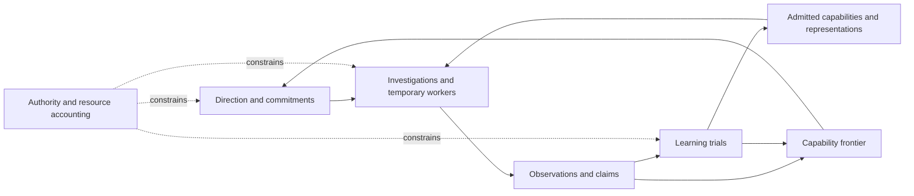

# Settlement: selected conceptual architecture

2026-09-07; refined 2026-09-08, companion status updated 2026-09-09. Selected design baseline, prepared under the user's instruction to decide the strongest architecture for the stated goal. This document completes a conceptual pass through R0-R4 of the refinement roadmap. R5 is developed separately in [REPRESENTATION-DESIGN.md](REPRESENTATION-DESIGN.md), R6 in [TECHNOLOGY-DECISIONS.md](TECHNOLOGY-DECISIONS.md), and R7 in [PRACTICAL-SPECIFICATION.md](PRACTICAL-SPECIFICATION.md). Implementation and empirical calibration remain unperformed. No runtime permissions or source behavior change through these documents.

The existing constitution and D1-D82 describe the earlier design. The user explicitly authorized treating them as reasoning aids rather than constraints on this redesign. Section 8 records what this design retains and replaces, so the reasoning remains traceable without preserving unsuitable rules. The vocabulary for this redesign is in [GLOSSARY.md](GLOSSARY.md). This pass is isolated in `tmp/architecture-refinement/`; it does not amend the concurrent implementation or the historical design documents.

## 0. What this document establishes

The goal is a general, persistent society that originates useful investigations, develops new capabilities and representations, and improves its own problem-solving and learning procedures while drawing inference from external models. Software engineering and mathematics are initial evaluation grounds, not the definition of its eventual scope. Model-weight training is not required by this design.

There is no specified distribution of all future tasks, universally reliable judge, or unlimited resource budget. Consequently, universal optimality and perpetual improvement are not claims this document makes. Its strongest defensible commitments are a precise operating model, conditional invariants, and experiments capable of rejecting its learning hypotheses.

We distinguish four kinds of statements:

| Kind | Meaning |
|---|---|
| Selected principle | The design choice we will use unless contrary evidence justifies revision. |
| Semantic requirement | Every conforming implementation must exhibit this behavior. |
| Conditional consequence | A property following from the stated abstract rules and assumptions; not yet a proof about software. |
| Empirical hypothesis | A proposed source of increased competence whose benefit must be measured. |

No symbols in this document prescribe a database schema, graph engine, programming language, or serialization format.

## 1. R0: philosophy

### 1.1 Purpose

The Settlement develops a growing repertoire of reliable ways to understand, construct, and investigate. Temporary workers contribute to a continuing collective whose future members can accomplish more, or accomplish comparable work with fewer resources, because of what earlier members discovered.

Its persistent identity is the continuity of authorized purpose, commitments, competence, and accountable history. A recurring personality, one privileged reasoning agent, or one fixed organization chart is not required for that continuity.

The human's intended long-term role is gardener: choosing the ground and direction, widening authority deliberately, and intervening when needed. Routine decisions inside that ground belong to the Settlement.

### 1.2 Five selected commitments

**F1. Grow transferable competence while honoring accepted obligations.** Improvement includes breadth, depth, reliability, efficiency, and learning efficiency. Store a competence profile rather than one universal fitness number. Trade-offs remain visible; a gain in one domain does not conceal a loss in another.

**F2. Preserve plural inquiry and coherent action.** Workers may pursue different explanations and methods. Shared commitments and finite resources have coherent ownership and accounting. No permanent lead model has exclusive authority to define truth or direct every investigation.

**F3. Accumulate behavior and abstractions.** Experience should be able to change invocable methods, tools, context policies, coordination patterns, and representations. Documents remain useful, but their existence is not evidence that capability increased.

**F4. Give exploration a bounded, protected opportunity.** Productive work and developmental exploration have explicit resource allocations. Exploration may pursue uncertain stepping stones; it cannot mint resources, repeatedly renew itself without a decision, or relabel internal activity as demonstrated progress.

**F5. Make self-change accountable to evidence and external authority.** Cognitive methods and bounded operating policies can evolve autonomously. The system cannot unilaterally expand its authority or validate an improvement solely by changing the test used to declare it improved.

### 1.3 Resolve the philosophical tensions

| Tension | Selected resolution | Cost accepted |
|---|---|---|
| Breadth versus depth | Keep specialists and test cross-family transfer; build generality through a portfolio rather than requiring every method to be general. | More conditional performance accounting. |
| Curiosity versus immediate usefulness | Maintain a bounded exploration allocation within the charter, including some work with uncertain near-term value. | Some investigations will produce no usable result. |
| Collective autonomy versus coherence | Decentralize reasoning; make commitments, authority, and resource allocation consistent. | Coordination is real work, not free emergence. |
| Self-change versus identity | Preserve authorized purpose and accountable lineage while permitting replacement of cognitive methods. | Revisions must explain migration and effects on outstanding commitments. |
| Confidence versus adaptability | Keep scoped, revisable warrants and alternative methods. | The system sometimes withholds a conclusion or uses a slower fallback. |

These choices avoid a global objective that trades a broken promise against enough unrelated novelty. The charter specifies which obligations are hard and which preferences may be traded. Until a trade-off is authorized, the system narrows the experiment or preserves alternatives rather than inventing the user's preferences.

## 2. R1: the intuitive picture

### 2.1 A working society

An investigation persists while its workers change. One worker gathers observations, another tries a construction, and another challenges the result. They exchange explicit findings, requests, and artifacts. Independent attempts can withhold their tentative conclusions until they have committed their own results. Cooperation can be as small as one worker or as large as the problem and budget warrant.

When a worker disappears, its successor sees what was attempted, what was observed, what remains uncertain, which commitments are active, and what action outcomes need reconciliation. It need not reconstruct the investigation from a summary of a personality's conversation.

### 2.2 A developing society

Repeated difficulty creates a candidate explanation: perhaps the current method is inadequate, the context is missing a distinction, or the problem needs a new instrument. The Settlement proposes a change and compares it with an existing approach. A useful change can be retained for a narrow scope before becoming a default elsewhere.

For example, workers struggling with large failure reports develop a witness-reduction method. Later, an investigator tests whether that method can reduce mathematical counterexamples under a different preservation condition. Success creates evidence of transfer; failure records where the analogy breaks. The new ability belongs to the society, not to either worker.

### 2.3 A society without a new user task

The Settlement examines its frontier and commitments. It may investigate a recurring failure, test a promising transfer, improve an evaluator, or explore a charter-compatible question. Each pursuit has an initial allocation and a next decision point. An informative failure can justify a different attempt. Repeated uninformative output does not justify automatic continuation.

Quiet is a valid state when resources, permissions, instruments, or useful opportunities are unavailable. A heartbeat establishes operational liveness; it does not establish intellectual progress.

The drawing describes relationships, not processes to deploy.

## 3. R2: conceptual parts and selected mechanisms

The original eight-part coverage map is retained. These are distinct questions, not necessarily eight software modules.

### 3.1 Direction: commitments plus a developmental portfolio

Separate a proposed agenda item from an accepted commitment. A commitment has conditions of fulfillment, a resource allocation, and amendment or withdrawal rules. An exploration proposal names the uncertainty or capability opportunity, the observations it seeks, its initial bound, and a decision rule for continuing.

Select exploration using task-conditioned estimates of learning opportunity, applicability to the charter, cost, and portfolio diversity. Treat these estimates as fallible scheduling inputs. Use bounded exploratory sampling where estimates are weak. Preserve a positive exploration opportunity in a feasible allocation epoch when eligible exploration exists; its size is policy, not a universal constant.

Do not use record age, self-reported importance, citation volume, or raw surprise as a sufficient justification for more resources. Do not make perpetual external usefulness a prerequisite for every intermediate stepping stone. Record the distinction between a speculative opportunity and an evidenced gain.

### 3.2 Experience and belief: scoped warrants with revisable support

Separate observations, interpretations, and warrants. An observation can establish that an identified source returned a result under stated conditions; broader claims require additional justification. Human preferences can be authoritative declarations without being empirical facts.

A claim names its proposition, assumptions, scope, and version. A warrant identifies the exact claim and evidence versions, the evaluating procedure, and its conclusion. Support, opposition, background reference, and authority are different relationships.

Evaluation obligations depend on the proposition and intended use. Formal proof, tests, measurement, reproduction, and human preference judgment establish different things. They are not interchangeable positions on a universal strength ladder. A finite test cannot discharge an unrestricted theorem obligation.

Maintain useful disagreement. If evidence is inconsistent, check scope, environment, measurement, and inference before selecting a conclusion. Seek a discriminating observation when available; repeated agreement between exposed workers is not a substitute.

### 3.3 Continuity and attention: durable investigations and constructed context

Persist the state needed to resume work and explain consequential decisions: objective, commitments, observations, alternatives, artifacts, unresolved obligations, chosen versions, and pending actions. This does not require access to private model internals or preservation of every generated reasoning token.

Build working context for a particular decision. Mandatory constraints, active commitments, current applicability conditions, and relevant invalidations take precedence over optional material. If those cannot fit, decompose the decision or retrieve in stages; do not silently drop a governing condition.

Context construction is an evaluable capability. Its evaluation measures continuation, constraint preservation, and downstream task performance, not summary elegance. Cold material remains discoverable by content and dependencies, with budgeted retrieval. Search does not require an already known identifier.

Keep actual evidence needed by active warrants and releases available. A digest or content hash is not a substitute for the artifact it identifies. Raw exploratory material can have a declared retention policy; deleting evidence explicitly changes what can still be re-inspected and supported. A finite store cannot promise endless growth with all bytes preserved. Exhaustion must lead to archival, policy-governed retirement, or explicit suspension, never silent corruption.

### 3.4 Competence: composable behavior and learned representations

The primary unit of variation is a versioned capability. It can implement a tool, a problem-solving procedure, a context policy, a work-decomposition strategy, or a coordination method. A role is a reusable bundle, and whole-bundle changes remain possible when interactions matter.

Capabilities have applicability conditions, observable outcomes, declared effects, resource bounds, and performance evidence. They may contain deterministic computation, model inference, or both. Contracts allow limited claims about composition; performance of a composition is evaluated at the level where it is used.

Representation invention is a first-class developmental move. The system can propose new distinctions and transformations that make a problem family easier to reason about, along with interpreters or translators that make those distinctions operational. A new representation must preserve the relevant problem semantics or carry a precisely qualified empirical claim. Shorter descriptions alone do not establish increased competence.

### 3.5 Deliberation and action: bounded, revisable attempts

An attempt performs an observe -> decide -> act -> assess cycle within an investigation. Its result may be a solution, new evidence, an informative failure, an explicit blocker, or an abandoned approach. Attempt completion and investigation fulfillment are distinct.

Decomposition states a dependency relation: all of these results are required, any one sufficient result is enough, or a result will determine the next branch. A failed child can trigger replanning; it does not automatically immobilize the parent. Hypotheses may remain provisional while bounded reversible investigation proceeds.

Every effectful step has an authorization check, resource reservation where required, an attempt identity, and an outcome record or unresolved outcome status. Recovery reconciles uncertain effects before blindly repeating them. Model inference, external tool effects, and state commits have different retry semantics.

### 3.6 Collective organization: temporary teams, consistent commitments

Choose worker compositions for the problem and evidence need. Preserve one-worker execution as a legitimate case. Parallel workers require a reason such as independent evidence, separable work, complementary methods, or useful alternative search.

There is no permanent privileged reasoning agent. An investigation can have a temporary planning responsibility; ownership is bounded, visible, and transferable. Shared state arbitration and resource accounting can be logically centralized without making one model the society's permanent mind.

Work acquisition uses leases where useful, but lease expiry only means loss of permission to commit future work; it is not evidence that a worker is dead. Separate liveness monitoring, ownership, and external action reconciliation. Coordination overhead and correlated failures count against the value of additional workers.

### 3.7 Learning: trials, transfer, consolidation, and retirement

Every candidate change names a causal hypothesis: what behavior should change and why that should help. Compare against a defined reference under a declared protocol. Bind evidence to the exact artifact composition, model configuration, task family, environment, and budget.

Use matched comparisons and sampled ablations to investigate contribution. Compare whole compositions when individual attribution is not identifiable. Do not grant causal credit merely because a capability was present during a success. Defer exact statistical estimators to the evaluation design, while requiring declared sampling, uncertainty treatment, and controls for adaptive reuse of evaluation data.

Maintain a bounded portfolio containing reliable defaults, scoped specialists, and promising experimental alternatives. Candidates move from proposed to trial-eligible to limited release to a scoped default only when the corresponding evidence obligations are met. Quarantine and retirement remain available from every released state.

Task families can develop alongside methods. Generated challenges must have meaningful validity conditions and cannot alone certify broad progress. A proposer cannot control the challenge, solution, judge, and final evidence of improvement without an independent check. Broad claims require independently selected transfer tasks.

Consolidation seeks useful reusable structure and removes unnecessary active complexity. It is not mandatory machinery for every one-off incident. A tool, abstraction, or additional worker earns retention through demonstrated use value, credible stepping-stone value within an allocation, or an explicit preservation obligation.

### 3.8 Self-governance: an evolving cognitive system inside stable authority

Separate four revision scopes:

| Scope | Selected treatment |
|---|---|
| Working context, temporary plans, per-attempt settings | Adaptive inside the current authority and resource envelope. |
| Tools, methods, representations, role bundles, routing and coordination policies | Autonomous versioned trials and scoped release. |
| Learning rules, curriculum policies, evaluator implementations | Autonomous proposals and isolated comparisons, with protected reference evaluation and stronger migration evidence. |
| Ultimate authority, hard resource limits, protected evaluation access, recovery control | Changed only through externally authorized procedures. |

Improved competence can satisfy a condition of an existing delegation; it cannot create a new delegation. Epistemic confidence, self-reported irreversibility, and successful task counts do not mint authority.

### 3.9 Alternatives considered

| Choice | Selected mechanism | Strong alternative | Why selected; when to reconsider |
|---|---|---|---|
| Carrier of learning | Capabilities and compositions | Whole-role or whole-agent evolution | Enables reuse and narrower comparisons; favor whole-bundle changes when interaction effects defeat decomposition. |
| Agenda | Commitments plus bounded exploratory portfolio | Entirely task-driven work or unrestricted novelty | Supports autonomous development while bounding opportunity cost; allocation policy needs experiments. |
| Memory | Evidence, working models, invocable competence with context construction | Transcript retrieval and textual lessons | Makes learning behaviorally testable; simple textual material remains adequate when execution evidence supports it. |
| Evaluation | Proposition-specific obligations | Universal verification ladder | Avoids treating incomparable checks as equivalent evidence. |
| Selection | Conditional competence profiles and matched trials | One decayed role-success score | Addresses task difficulty, model changes, and specialization; retain simple selection where data are sparse. |
| Organization | Temporary teams with coherent commitments | Permanent hierarchy or unrestricted peer chatter | Preserves the user's society intent while exposing coordination costs. |
| Self-change | Scoped releases under stable authority | Human approval for every cognitive change | Enables meaningful unattended development without self-authorized expansion. |
| Retention | Protect active evidence; declared retirement and archival | Preserve every raw byte forever | Makes bounded resources explicit; preservation obligations can require more storage or suspension. |

No selected mechanism is justified merely by sounding more sophisticated. Each empirical advantage has a rejecting experiment in section 7.

### 3.10 The selected engine of development

The central developmental mechanism is **explanation-guided search over methods, representations, and challenges**. An explanation is a fallible proposal for which change would help, not privileged access to a model's internal reasoning. External model inference proposes changes; instruments, trials, and subsequent use determine what is retained. All of the following can operate without updating model weights.

The search has five connected moves:

1. **Identify a bottleneck or opportunity.** Repeated failures, expensive successful steps, conflicting predictions, missing instruments, and structural similarities between investigations can initiate development. A candidate diagnosis predicts an observable consequence: for example, supplying a missing distinction should remove a particular failure while adding more workers should not. When distinguishable, compare that intervention against a competing explanation before funding an expensive rewrite.
2. **Construct a different way to solve the problem.** A candidate can change an instrument, representation, decomposition, procedure, context policy, or team arrangement. It includes how to invoke the changed behavior and how to interpret its output. A description that no future attempt can use remains a proposal. Whole compositions can change together when the proposed advantage depends on their interaction.
3. **Find reusable structure.** Across concrete solutions, propose a common operation, the varying parameters, and the conditions under which the operation remains valid. Stable portions may become deterministic computation; unresolved choices may continue to invoke models. The system must compare the abstraction's use cost and failure modes with the original procedures. Compression is a search hint, not the release criterion.
4. **Probe the boundary of transfer.** Translate a different task family into the candidate's terms, then test both the translation and the method. Preserve negative transfer evidence: two tasks sharing vocabulary need not share a solvable structure. Generated challenges can locate an applicability boundary; independent tasks establish the claimed gain beyond the examples used to invent it.
5. **Change the future search.** A retained method changes which investigations are feasible. A new representation can expose previously unnamed problem families; a new instrument can make previously untestable conjectures investigable. These become frontier proposals with bounded allocations. Whether a challenge is worth exploring and whether it demonstrates progress remain separate decisions.

The **frontier** is the society's revisable account of opportunities near its present competence: a task family or unresolved question, applicable resources and methods, current evidence, proposed prerequisite or transfer relationships, and the next distinguishing observation. It includes unknown regions and competing descriptions. It is neither an exhaustive map of possible knowledge nor a promise that difficulty is one-dimensional. A hypothesized prerequisite is tested where practical; the system does not indefinitely refuse investigation merely because it drew an unverified dependency.

Operational explanations also provide a limited world model: scoped predictions about what an intervention will change and under which conditions. Keep those predictions attached to their evidence and counterexamples. The architecture does not assume that a language model can construct a complete, correct model of the world. A useful prediction can guide an experiment while remaining explicitly uncertain.

There are consequently three distinct products of development: improved behavior, a better explanation of its applicability, and newly testable questions. None automatically establishes the other two. For example, a procedure can perform well before its mechanism is understood; a correct explanation can reveal why a proposed improvement will not work.

This mechanism is the main architectural bet. Provenance and release control make its outcomes inspectable; the search itself must earn its complexity through E1-E3 and E7. If explanation-guided proposals do no better than simpler mutation and selection at equal cost, retain the simpler proposal policy without losing the surrounding semantics.

## 4. R3: abstract semantics

### 4.1 State and environment

Write the Settlement's semantic state as S = (P, G, K, C, W, B, V, H):

| Symbol | Meaning |
|---|---|
| P | Authorized policy: effect permissions, resource envelopes, commitment rules, and evaluation governance. |
| G | Proposed agendas, accepted commitments, and investigation objectives. |
| K | Observations, claims, warrants, and registered support/opposition dependencies. |
| C | Capability versions, compositions, applicability claims, and competence profiles. |
| W | Attempts, ownership, durable working states, and unresolved effects. |
| B | Resource allocations, reservations, measured consumption, and reconciliation state. |
| V | Active releases and the versions assigned to running investigations. |
| H | Retained history and lineage required by the retention and accountability policy. |

The external environment E is not part of S and is not assumed fully observable or controllable. Receiving a report about E changes the Settlement's observations, not E's actual state. An effect can change E even if its response is lost.

An operation induces a transition S --[operation, observation]--> S'. Nondeterministic model output is a proposal or observation interpreted under these rules. It is not itself authority to perform a transition.

### 4.2 Semantic entities

An **investigation** contains an objective, scope, origin, resource sponsor, completion obligations, alternatives, dependencies, stopping conditions, and a revision. A proposal is not a commitment until admitted. Every autonomous proposal traces to an existing charter-compatible allocation or accepted investigation; that provenance does not automatically establish its intellectual value.

An **attempt** binds one investigation revision to a capability composition, model/environment declarations, ownership generation, resource reservation, context revision, and effect log. Its lifecycle is prepared, running, suspended, completed, failed, or cancelled. An unresolved external action is a separate status; cancellation of an attempt does not prove that action never happened.

A **claim** is a proposition with quantified scope and explicit assumptions. Changing the proposition, assumptions, or quantified scope produces a different claim version.

A **warrant** binds a claim version to evidence versions, evaluation procedure/version, evaluation conditions, outcome, and registered dependencies. A current decision asks whether the warrant is admissible for that decision's obligations; it does not ask whether an undifferentiated row is eternally verified.

A **capability** c consists abstractly of a version, applicability predicate A_c, behavior pi_c, outcome obligations O_c, permitted effect description E_c, resource bound R_c, dependencies, and evidence profile. Behavior pi_c maps the visible work history to a next-operation proposal or a distribution over such proposals. This describes meaning, not a chosen executable format. Declared predicates and guarantees remain claims until discharged by an appropriate procedure.

A **learning trial** binds a candidate, reference, task selection protocol, execution conditions, resource envelope, outcome measures, uncertainty treatment, and decision rule before scoring. An amendment creates a new protocol version; it cannot silently change the interpretation of completed trials.

A **release** admits an immutable capability or composition version for a stated applicability scope. Provisional availability for isolated experiments, limited live use, and selection as a default are distinct release classes.

### 4.3 Authority and resource rules

For any proposed operation a and attempt w:

    Dispatchable(a, w, S) =
        current_owner(w, S)
        AND permitted_effect(a, authority(w), P)
        AND compatible_versions(a, w, V)
        AND required_evidence_present(a, w, K)
        AND sufficient_reserved_resources(a, w, B)

Each term has a limited meaning:

- Ownership is a current issued generation, not a model-supplied name.
- Permission concerns enforceable effects and scopes. An operation's self-description as free, safe, or constructive does not classify its actual effects.
- Version compatibility is checked against the dependencies needed for the operation, not merely against a current default model label.
- Required evidence is a finite, declared set of obligations with checkable outcomes. This predicate is not an oracle for truth or charter alignment.
- A model's interpretation of broad charter language can guide proposals, but does not produce a hard guarantee that all behavior expresses human intent.

For each consumable resource domain d in an authorized accounting epoch:

    measured_consumption_d + outstanding_reservations_d <= authorized_budget_d

Reservations precede dispatch and use an enforceable upper bound on exposure. Settling an action moves measured consumption out of its reservation and releases only the unused portion established by its receipt. An uncertain effect retains the corresponding exposure. Delegations subdivide the parent's available allocation; the same resource is not counted as newly available at each level of decomposition.

Occupancy resources use current occupancy plus outstanding reservation rather than lifetime consumption. Release requires evidence that occupancy has ended. Deadlines are separate constraints; an accounting equation cannot promise that an external provider responds on time.

If an effect's cost cannot be bounded, it is not eligible under a hard cost guarantee. Narrow the operation, impose an enforceable external limit, or request a different authorization. A postpaid ledger entry cannot retroactively enforce a ceiling.

### 4.4 Evidence admissibility and revision

An evidence profile states which obligations a procedure can discharge. Examples are: a named theorem under explicit axioms; tests on identified input families; a measured property under identified instruments; or a particular human's acceptance of an artifact. Formal checking of the wrong proposition is inadequate for the intended claim.

Admissibility at a decision epoch requires:

1. Exact subject, artifact, and relevant environment versions match the obligation.
2. The procedure's admissible scope covers that obligation.
3. Required evidence is available and its provenance is recorded.
4. The support derivation is finite and well founded, ending in admissible observations, declarations, or proof premises.
5. Registered defeating evidence and invalidated assumptions have been processed under the decision protocol.

Background references and observations of what somebody said are not automatically supporting premises. A cyclic set of claims cannot create its own evidentiary root. Alternative valid derivations may survive invalidation of one supporting route.

When a claim or premise is retracted, record the change and invalidate affected cached admissibility results through registered support dependencies. Before a dependent claim is used to discharge an obligation, recompute its support at the relevant epoch. This is an abstract requirement; eager propagation and lazy checking are alternative later representations.

The rule covers registered dependencies. It cannot guarantee detection of every undeclared semantic dependency. Missing dependencies are a measured failure mode and a reason for independent scrutiny.

### 4.5 Composition and representation change

For capabilities a and b, a sequential composition requires the established outcomes of a to satisfy b's applicability conditions under compatible assumptions. Its allowed effects are contained in the invoking authority, and its resource reservation covers the composition. When the implication cannot be established formally, label the composition empirically supported only within its tested scope.

Individually good capabilities may interact badly. Context builders can remove information another method requires; independently valid edits can conflict. Therefore a released composition carries its own evaluation where interface contracts do not settle the interaction.

A representation proposal names a task translation T and result interpretation D. For a semantics-preserving reduction on task family X, the desired obligation is:

    for each x in X and admissible result y:
        Satisfies(T(x), y) implies Satisfies(x, D(x, y))

Here Satisfies is the task's defined specification relation, not an assumed universal decision procedure. Proof of this implication supports a reduction claim. Example-based testing supports only an empirical fidelity claim. Either route must also measure whether the representation improves resource-bounded task performance.

A representation may be lossy when the lost distinctions are explicitly outside the supported use. It must not claim semantics preservation in that case. New representational vocabulary is permitted; no fixed domain taxonomy is imposed at this level.

This implication establishes soundness of decoded solutions, not completeness or usefulness: a translation that has no solutions would satisfy it vacuously. A representation's obligation must therefore also identify the relevant coverage, constructibility, and resource conditions. Where preservation of solvability is claimed, it needs the reverse existential implication on that scope. Optimization tasks additionally need a relation between objective values or approximation error. Performance trials include translation failures and tasks for which no output is produced.

### 4.6 Progress and release decisions

For a versioned system composition c, task distribution or declared finite population D, resource envelope b, and evaluation conditions e, define a performance profile:

    P(c; D, b, e) = expected outcome vector under the declared sampling protocol

This is a target quantity, usually estimated rather than known. Timeouts, invalid outputs, and evaluator failures receive their predefined classifications; they are not silently dropped from the comparison. Evaluator unavailability can make a trial inconclusive rather than a solver failure, but that handling must be declared and reported for both candidate and reference.

Learning is a retained change supported by a comparison of profiles within an explicitly stated scope. Storing a candidate, finishing a task, or changing model provider is not by itself evidence of learning.

A protocol seeking an improvement in coordinate k may require:

    lower_bound(delta_k) > minimum_useful_gain_k
    lower_bound(delta_j) >= -allowed_regression_j  for each protected coordinate j

Coordinates are oriented so that larger is better. Bounds must have coverage justified by the actual sampling design, including dependence and adaptive selection. The protocol fixes tolerances, error treatment, and stopping rules before the trial. No universal sample count, confidence constant, or acceptable regression is invented here; these must be instantiated for the task family before an actual release decision.

A candidate can enter a narrow limited release without proving superiority everywhere, provided the corresponding obligations and fallback rules are met. If non-regression on a broader scope is unresolved, preserve the incumbent there. Release routing is itself evaluated; retaining a good fallback does not prove the router will select it correctly.

Account for learning expenditure separately from subsequent execution expenditure. Report learning curves and amortization over declared reuse assumptions. A method that costs more to discover than it will save can still justify exploration, but cannot be reported as a demonstrated efficiency gain over that horizon.

### 4.7 Transition obligations

| Operation | Required preconditions | Durable consequence |
|---|---|---|
| Propose an investigation | Identified origin, objective, sponsor, and initial bound. | Proposal exists without an automatic commitment or resource grant. |
| Admit or amend a commitment | Authority, feasible allocation, declared fulfillment and withdrawal conditions. | A versioned obligation and its allocated resources exist. |
| Acquire work | Eligible investigation revision, compatible composition, issued authority, available allocation. | A current ownership generation and prepared attempt exist. |
| Dispatch an operation | Dispatchable holds; operation intent and identifier are recorded first. | An in-flight operation and reserved exposure exist. |
| Receive a result | Attribution to the issued operation; duplicate handling and version checks. | Observation and effect outcome are recorded; resources settle where justified. |
| Revise a belief | Identified claim/evidence versions and support or opposition relationship. | A new warrant or invalidation event; history is retained under policy. |
| Complete an attempt | Execution result or explicit failure/blocker recorded. | Attempt is terminal; investigation fulfillment is assessed separately. |
| Fulfill an investigation | Declared completion obligations hold for the relevant revision. | Commitment is fulfilled with evidence, not merely with generated text. |
| Decompose or replan | Current planning authority; explicit dependency semantics and inherited allocation. | Child investigations and revised obligations; no new root resources. |
| Propose a capability | Identified behavior, applicability, effects, bounds, and change hypothesis. | An untrusted candidate version becomes available for admissible trials. |
| Run a learning trial | Frozen protocol, bounded execution, isolated candidate, reference conditions. | Candidate/reference outcomes and uncertainty or inconclusiveness are recorded. |
| Release or quarantine | Scope-specific decision rule; exact versions; fallback and migration conditions. | Release membership changes; unaffected attempts keep their pinned versions. |
| Revise learning machinery | Permitted revision scope; comparison outside the candidate's sole control. | A versioned release under the unchanged external authority. |
| Change external authority | Authentic external authorization under the anchor's procedure. | A new policy version; no retrospective rewriting of historical outcomes. |
| Suspend or recover | Ownership invalidation where needed; pending effects identified. | Work state is recoverable and unresolved exposure remains accounted for. |

These operations describe semantic responsibilities. They do not require one network call or one software method per row.

Fulfillment also checks the issued completion authority, current generation where ownership is exclusive, and unfulfilled status in the same transition. A collaborating worker can submit evidence without thereby owning the right to close the investigation.

Version pinning preserves reproducibility, not an irrevocable permission to continue. Quarantine, authority revocation, and invalidated prerequisites govern subsequent dispatch and fulfillment even for a pinned attempt. Stop or suspend affected work at the enforcing boundary; preserve and reconcile any already dispatched effects. No instantaneous cancellation of an uncontrollable external action is assumed. Ordinary release upgrades can leave unaffected attempts pinned; emergency restrictions cannot be bypassed by that pin.

### 4.8 Conditional invariants

The following assumptions are part of the claims, not implementation details that may be omitted later:

- **A1 Complete mediation:** all relevant effects, state admissions, and resource use cross the enforcing interfaces. Worker-generated code and evaluators cannot bypass them.
- **A2 Consistent accounting:** conflicting admissions and ownership changes have one authoritative order, and required committed records survive the faults in the declared failure model.
- **A3 Authentic control:** issued authority and externally authorized revisions cannot be manufactured by worker content.
- **A4 Bounded exposure:** reserved upper bounds are enforced by the relevant execution environment or provider contract. Where this is unavailable, that operation is outside the hard bound claim.
- **A5 Faithful evidence processing:** the implementation respects the declared dependency, version, and evaluation rules. External sources are not assumed infallible.
- **A6 Recovery availability:** the supervising control and retained recovery material remain accessible within the declared fault model, with reserved capacity for supervision, recording outcomes, and reconciliation. Task admission cannot consume that protected capacity. Total loss of all copies is not recoverable by definition alone.

**I1 Authority confinement.** Within an authority epoch, every dispatched effect lies within the invoking authority, and an internal revision cannot enlarge that authority. Under A1-A3, the base state has issued authority; dispatch checks its current scope in the authoritative admission order, and no internal transition can replace the external grant. Induction over transitions establishes confinement relative to the actual enforced effect classification. It does not prove that an imperfect classifier understood arbitrary program semantics. Revocation governs new dispatches; it cannot retroactively prevent an already authorized external effect.

**I2 Resource conservation.** For a consumable resource domain, measured consumption plus outstanding exposure cannot exceed the authorized budget under A1, A2, and A4. Reservation subtracts only available capacity. Settlement converts reservation into consumption without increasing their sum. Uncertain outcomes retain exposure; delegation partitions capacity. Composition of these transitions preserves the bound. An authorized reduction below already committed exposure stops new admissions and records the old liability; it does not rewrite history or retroactively make the earlier bound false.

**I3 Exclusive completion.** An exclusive investigation revision accepts at most one terminal fulfillment commit. Under A2 and A3, fulfillment checks the current issued ownership generation, revision, and unfulfilled status in the same authoritative transition. A successful transition changes that status; competing or stale transitions fail. A reopened investigation has a new revision. This is not an exactly-once guarantee for external effects.

**I4 No circular evidentiary promotion.** Under A5, an admissible support derivation cannot be created solely by a cycle of claims citing one another. The well-founded derivation requirement terminates in admissible roots; a rootless cycle fails it. This establishes structural grounding, not the truth of every external premise or the correctness of every human-authored specification.

**I5 No silent reassignment of evidence.** Under A2 and A5, a warrant or trial result about one version cannot become a result about a different version merely because a default pointer changed. Subject identity is immutable, and release checks exact versions. Transfer to a new model or environment requires an explicitly scoped new claim and evidence appropriate to it.

**I6 No self-certified improvement through evaluator replacement.** Under A1-A3 and A5, an evaluation procedure change alone cannot discharge a comparative improvement obligation about that same change. The release requires a protected reference comparison or externally established judgment outside the candidate's sole control. This prevents the structural circularity; imperfect reference tasks can still be exploited, so this is not a proof against all reward hacking.

These are hand-checked arguments about the abstract rules. A later implementation must discharge A1-A6 and verify its transitions. No machine-checked proof or guarantee of universal learning is claimed.

### 4.9 Liveness and bounded non-progress

Safety invariants do not imply useful progress. Liveness additionally requires runnable work, sufficient resources, functioning dependencies, and fair service among the finite set of admitted attempts. An unlimited backlog does not create an unlimited service obligation.

Each admitted attempt has a finite execution or decision budget and a next decision deadline. Under an available supervisor, it eventually records completion, failure, cancellation, or suspension. An unresolved external outcome can remain unresolved beyond that point and must stay visible. Time spent reconciling is budgeted; endless polling is not a learning activity.

Stalled investigations return to a decision point: continue with explicit additional allocation, change method, narrow the objective, obtain missing authority or evidence, or suspend. The system cannot guarantee a correct solution for every task. It must guarantee truthful classification of what is known about its progress under the implementation's fault model.

### 4.10 Semantics of developmental search

Let a developmental configuration Gamma contain the available capability compositions and the policies for context, decomposition, selection, coordination, and learning. These components identify replaceable behavior; they do not imply separate software services. Authorized policy P is outside unilateral modification by Gamma.

A development proposal q consists of:

    q = (reference_Gamma, proposed_change, causal_hypothesis,
         supported_scope, distinguishing_protocol, allocated_budget,
         disposition_rule)

The proposed change can introduce new vocabulary and a task interpretation, not merely select among existing names. It becomes operational only through an invocable interpretation with stated obligations. Retrieved instructions cannot activate themselves as capabilities; candidate admission, trial execution, and release are explicit transitions under unchanged authority.

A learning policy L maps the retained developmental state and available allocation to a proposal, an information-gathering investigation, or suspension. Trial observations then support a disposition: reject, remain inconclusive, preserve an experimental alternative, admit a scoped release, or quarantine a previous release. This is a resource-bounded search with a retained portfolio, not a presumption that each transition increases fitness.

To compare learner versions L0 and L1, begin with equivalent declared initial capabilities and information access, allocate the same total development envelope, and evaluate the resulting configurations over a declared evaluation protocol. Include candidate construction, failed trials, context construction, coordination, evaluation, and selection in that envelope. Prevent one arm's newly discovered answers from silently becoming the other arm's initial knowledge; any shared information policy must be declared symmetrically.

The comparison observes both achieved performance and performance over the learning trajectory. The protocol states whether terminal competence, earlier availability, broader coverage, or another coordinate is primary. Measuring only generated-task scores, candidate count, or the best lucky endpoint does not establish more effective learning. New domains can have new protocols; a claim about progress across domains requires a declared bridge and cannot be created by renaming the evaluation population.

Neither this specification nor the frontier requires an exact expected value of information oracle. Proposal estimates may be weak or wrong. Bounded exploratory allocations permit finding out; renewal uses the resulting evidence, opportunity costs, and declared decision policy. The proposal and renewal policies are themselves candidates for later comparison.

## 5. R4: abstract architecture

### 5.1 Seven module responsibilities

These are semantic seams chosen to concentrate obligations. Process and deployment boundaries remain undecided.

| Module | Interface responsibility | What callers can rely on |
|---|---|---|
| Stewardship | Admit commitments; issue bounded authority; reserve and settle resources; gate releases and recovery. | Coherent permissions and accounting, including uncertain exposure. |
| Investigations | Propose, acquire, revise, decompose, resume, and assess fulfillment of work. | Persistent work identity and explicit obligations across disposable workers. |
| Evidence | Admit observations and warrants; inspect support and opposition; construct scoped evidence views. | Attribution, version binding, retrievable evidence, and current registered invalidations. |
| Capabilities | Describe, compose, inspect applicability, and select among candidate and released behaviors. | Explicit contracts, dependencies, scopes, and competence profiles. |
| Execution | Run bounded attempts; dispatch permitted operations; report observations; stop and reconcile. | Effects are separated from reasoning proposals and their uncertain outcomes are preserved. |
| Evaluation | Execute declared comparison/checking protocols and return attributable results. | Results refer to the actual tested versions, sampling rules, budgets, and conditions. |
| Development | Propose investigations and changes; interpret trial evidence; consolidate and retire capabilities. | Learning decisions have recorded hypotheses, references, and dispositions. |

Development cannot write its own successful evaluation receipt. Evaluation implementations can be candidates for improvement, but reference evaluations have protected access and independent admission. Capabilities cannot grant execution authority. Evidence cannot turn a recorded instruction into a control instruction simply by returning it in a search result.

The original eight conceptual parts map across these seams. Direction is shared by Investigations, Development, and Stewardship; attention spans Evidence, Capabilities, and Execution; collective organization is expressed through Investigation ownership and capability compositions. A conceptual concern need not become a standalone module.

### 5.2 Three feedback loops

**Execution loop:** investigation -> applicable composition -> bounded attempt -> observations -> revised investigation. It optimizes the next useful action under current knowledge and commitments.

**Development loop:** observed limitation or opportunity -> change hypothesis -> candidate -> comparison -> scoped disposition -> new competence profile. It changes how future attempts operate.

**Agenda loop:** competence profiles and charter -> frontier opportunities -> allocated investigations -> learning and task outcomes -> revised frontier. It changes which experiences the society chooses to obtain.

The loops share evidence but have separate obligations and resource allocations. Otherwise Development can consume every resource while claiming it is serving future work, or immediate task demand can eliminate all learning. A mechanical supervisor handles ownership expiry, deadlines, wake conditions, and recovery independently of model inference. Strategic choices can use models within bounded attempts.

### 5.3 End-to-end ordinary work

1. A request or autonomous proposal becomes an investigation candidate with an origin and objective.
2. Stewardship admits a commitment only with applicable authority, resources, and fulfillment conditions. Unsupported promises remain proposals.
3. Investigations selects or accepts a bounded planning responsibility. Capabilities supplies an eligible composition based on relevant evidence; an experimental composition receives experimental scope.
4. Evidence supplies the current obligations, observations, disputed assumptions, and material needed for the next decision. The context procedure reports its input versions.
5. Execution records an operation intent, obtains the required reservation and authorization, and dispatches it.
6. The result is admitted with actual execution provenance. A lost result leaves an unresolved operation; it does not fabricate a failure or a success.
7. The attempt revises its approach or finishes with a declared result. An investigation can replace failed branches without requiring every child to become a verified success.
8. Evaluation discharges the fulfillment obligations at the required scope. Stewardship and Investigations accept fulfillment only for the matching current revision.
9. Evidence about the attempt contributes to conditional competence profiles. A separate comparison is required before reporting a durable improvement in capability.

### 5.4 End-to-end autonomous development

1. The frontier exposes a recurrent limitation, a transfer opportunity, or a bounded speculative question.
2. Development creates a hypothesis and a distinguishing trial. It identifies what outcome would favor the current method instead.
3. The experiment receives resources from its allocation. Extra descendants subdivide those resources rather than inherit an unlimited copy of the parent's value.
4. The selected workers construct a candidate capability, composition, context policy, or representation in experimental scope.
5. Evaluation runs candidate and reference against declared tasks, actual versions, and comparable conditions. Known baseline failures are opportunities to improve; the requirement is not to reproduce every old failure.
6. Development records a scoped gain, regression, inconclusive result, or unsupported hypothesis. It may preserve a bounded stepping stone without promoting it to the default.
7. A release decision checks evidence, applicability, effects, resource costs, and migration. New investigations can use the new release; existing ones remain pinned or migrate explicitly.
8. Later work supplies transfer and regression evidence. The frontier changes because observed competence changed, not because the candidate wrote a flattering self-description.

### 5.5 Revision of learning itself

A change to Development, evaluation policy, context selection, or team formation is itself a candidate. Its trial compares complete learning trajectories over a bounded resource budget, including downstream use, rather than comparing only how many candidates it generates.

The incumbent learner remains the reference until a declared release decision. The candidate cannot choose the only tasks and labels that establish its own improvement. Reference protocol revisions preserve old results under their original meanings and establish an explicit bridge before comparisons across epochs.

Before activation, record compatibility with outstanding work, the admitted target scope, required state migration, and a recovery strategy. Recovery preserves the identity and liabilities of in-flight external actions. Reverting a cognitive version does not undo a message sent, a charge incurred, or an external mutation already performed.

### 5.6 What must be seeded

Provide an initial authorized purpose, enforceable effect/resource limits, a recoverable execution environment, a small functioning capability composition, and a few externally grounded evaluation tasks. Include basic observation, artifact manipulation, model inference, and a reliable way to record and revisit outcomes.

The initial feedback need not cover every eventual domain. The Settlement can extend its instruments and evaluators; new domains initially carry narrower evidence claims. There must nevertheless be some grounding beyond model agreement. A society that controls all questions, answers, and judges has no independent basis for claiming growth.

No particular model provider, framework, vector store, permanent agent hierarchy, or handcrafted specialist catalog is assumed here.

### 5.7 A concrete trace of accumulated abstraction

The following is a proposed behavior trace, not an experiment already performed. It illustrates what changes in the society across several investigations.

| Step | Investigation and observation | Proposed durable change | Obligation before the stronger claim |
|---|---|---|---|
| 1 | Large software failure examples consume most of the diagnosis budget. | Hypothesis: removing irrelevant structure while preserving a failure witness will help. | Distinguish diagnosis cost from other bottlenecks; record what constitutes the same failure. |
| 2 | A bounded experiment finds smaller witnesses for a declared program family. | An invocable reducer with candidate transformations and a failure predicate. | Validate the predicate and transformations; compare diagnosis performance including reduction cost. |
| 3 | Several successful reducers repeat the same search structure. | A parameterized reduction method over an object, candidate reductions, a measure, and a witness check. | Define a well-founded decreasing measure for terminating accepted reductions, bound unsuccessful search, and preserve the intended witness. Do not claim a globally minimal witness from local irreducibility. |
| 4 | A mathematical investigator has a large finite counterexample. | A translation into the reduction interface with domain-specific transformations and a counterexample predicate. | Check validity of the mathematical predicate and decoded object; software failure preservation does not establish mathematical counterexample preservation. |
| 5 | Independently selected counterexamples become easier to inspect at comparable total cost. | A scoped mathematical specialization plus transfer evidence for the shared method. | Keep failures and unsupported families in its applicability profile; retain an alternative for tasks outside that scope. |
| 6 | Smaller witnesses expose a recurring structural obstruction. | A new distinction and a conjecture describing the obstruction, with a challenge generator to search for exceptions. | Generated examples can refute the conjecture or support a finite empirical claim; an unrestricted theorem still requires the corresponding proof. |
| 7 | The new distinction predicts where the reducer fails. | Revised routing and frontier proposals, possibly a different representation for those cases. | Evaluate the route and representation; the explanation's usefulness is not guaranteed by a persuasive narrative. |

What persists is an invocable abstraction, multiple grounded interpretations, a conditional profile, counterexamples, and new research opportunities. Temporary workers can disappear without erasing these changes. Another development trajectory may fail at step 2 or step 4; the architecture must preserve that result without pretending the example demonstrates inevitable transfer.

## 6. Adversarial scenario review

This review was performed within this design pass, not by independent reviewers. The table records failure cases and required behavior; it is not evidence that an implementation already handles them.

| Case | Naive failure | Required behavior in the selected model |
|---|---|---|
| Two workers spend the same remaining allocation | Both pass a pre-call balance check. | Reserve exposure in one authoritative order before either dispatch; I2. |
| A paid call returns after its worker disappears | Work is retried and the first charge is forgotten. | Retain operation identity and exposure, reconcile the receipt, and separately reacquire work. |
| An external effect has no idempotency or status query | Recovery assumes the missing response means nothing happened. | Record uncertainty; do not blindly repeat an effect whose duplication is unacceptable. |
| A slow worker outlives its lease | Both old and new workers commit completion. | Current generation and work revision gate the terminal commit; I3. |
| A capability calls a provider outside the mediated path | The budget proof appears correct but omits real spending. | A1 is unsatisfied; no confinement or hard ceiling claim is allowed until that path is controlled. |
| A role wins many trivial tasks | Success counts widen unrelated competence or permissions. | Scope outcomes to task families; authority changes only under an existing grant or external authorization. |
| Two claims justify each other | A circular citation structure becomes knowledge. | Require a well-founded support derivation with admissible roots; I4. |
| A supporting claim is retracted | A grandchild remains marked verified indefinitely. | Revalidate the registered support closure before the dependent obligation is discharged. |
| A theorem passes finite examples | Empirical support is promoted to unrestricted proof. | Retain the quantified finite claim; theorem obligation remains open. |
| A candidate changes its evaluator to always pass | Self-reported performance rises. | Protected reference comparison is missing; no improvement release follows; I6. |
| Repeated trials overfit one hidden set | A nominal holdout becomes a training signal. | Track adaptive exposure; refresh or isolate evaluation and use valid comparison protocols. Secrecy alone is insufficient. |
| Many differently named agents repeat one source | Agreement is mistaken for independent reproduction. | Record evidence/source exposure; correlated agreement does not satisfy an independence obligation. |
| A novelty source stays unpredictable | Curiosity repeatedly rewards noise. | Require a bounded opportunity and next decision rule; raw surprise does not authorize renewal. |
| One child returns a useful negative result | Parent waits for every child to be successful. | Apply the investigation's dependency semantics and replan or discharge the relevant obligation. |
| A new context policy omits a critical restriction | Faster execution is scored as improvement. | Mandatory-context obligation fails; comparison includes constraint violations. |
| A forgotten counterexample becomes relevant | Hot-only search cannot discover it. | Budgeted search can reach cold evidence by meaning and registered relationships. |
| One specialist improves while another regresses | A global average hides the regression. | Preserve conditional releases and explicit protected coordinates; evaluate routing. |
| A provider changes behavior under the same alias | Old capability evidence is treated as current. | Record available provider/version metadata and drift evidence; narrow or renew claims when equivalence is unknown. |
| Resources are exhausted | Maintenance and recursive proposals continue indefinitely. | Stop new admissions, preserve active obligations and unresolved effects, and expose suspension. |
| Evidence storage is retired | Hashes are treated as if full evidence were still inspectable. | Update availability and support claims; active preservation obligations prevent unapproved deletion. |
| A rollback follows an external action | Old state makes the action appear never to have occurred. | Preserve the operation ledger and reconcile external reality across the rollback. |
| A quarantined method is pinned by a running attempt | Reproducibility is treated as permission to ignore revocation. | Recheck eligibility at dispatch and fulfillment; suspend affected work and reconcile earlier effects. |
| A representation has no decodable successful outputs | A vacuously true soundness condition is reported as useful reduction. | Check the separately declared coverage and solvability obligations; include non-output cases in performance. |
| An explanation sounds compelling but changes no behavior | Narrative quality is counted as learning. | Require an invocable intervention and scoped outcome evidence; keep the explanation provisional. |

## 7. Empirical obligations and rejection criteria

The learning theory is not established by the invariants. These experiments are required before claiming architectural superiority.

| ID | Hypothesis | Comparison | Result that would undermine it |
|---|---|---|---|
| E1 | Composable capability evolution uses learning resources better than whole-role evolution. | Same model access, task sequence, total development budget, and initial abilities; compare both approaches and a frozen baseline. | Gains vanish under matched resources or composition overhead erases them. |
| E2 | Learned representations produce transferable competence. | Evaluate new, independently selected tasks with and without the representation, including its construction and interpretation costs. | It only compresses seen examples, changes the task semantics, or fails on new instances. |
| E3 | Autonomous curricula improve useful future performance. | Frontier-driven, random-valid, failure-driven, and fixed curricula under equal learning budgets. | Generated-task scores rise while independently selected task performance does not. |
| E4 | Learned context construction improves continuation and efficiency. | Compare with a strong fixed retrieval/context baseline; include interrupted and adversarially distracting work. | Apparent savings come from omitted obligations or degraded downstream performance. |
| E5 | Adaptive teams outperform a strong single worker where selected. | Match total inference and tool budgets; include latency, coordination overhead, and correlated errors. | Multiple workers add cost without improvement on the task families where the policy selects them. |
| E6 | Scoped releases preserve earlier competence while extending it. | Longitudinal mixed-task evaluation, including routes where new specialists should not be used. | Regressions are hidden by aggregate averages or the router cannot reliably select the retained fallback. |
| E7 | Changes to the learner improve learning efficiency. | Compare complete incumbent/candidate learning trajectories over multiple initial conditions. | Candidate generation increases but downstream competence per learning budget does not. |
| E8 | Evaluation governance withstands incentives to self-certify. | Deliberately test changed judges, contaminated task pools, selective result omission, and version mismatches. | Such a change receives an unsupported release or broad improvement label. |

Task-family sampling, useful-gain thresholds, permitted regressions, confidence/error budgets, trial horizons, retention periods, and exploration allocations are explicit calibration obligations. They must be fixed or governed by a predeclared policy before the corresponding comparison, not chosen after seeing favorable outcomes.

The relevant objective is useful performance over a declared horizon including development costs. API access being inexpensive does not make latency, context, local compute, storage, or attention free.

## 8. What changes relative to the earlier design

This is a replacement map for the target design, not an edit to historical decisions. The user's instruction permits choosing different principles. Before implementation, the new practical specification must replace incompatible old acceptance criteria.

| Earlier decision or article | Selected treatment |
|---|---|
| D6, D8: external inference and disposable bodies | Retain; persist investigation state as well as reusable expertise. |
| D9: role is the unit of selection | Replace with capability and composition variation; retain roles as useful bundles. |
| D10-D12: friction and escalation | Retain friction; add transfer, evaluator gaps, and bounded speculative exploration without requiring an observed failure first. |
| D14: testability is evolvability | Retain and sharpen: tests widen empirical reach; they do not make arbitrary external acts reversible. |
| D16-D17 and Article 8: verification and citation promotion | Replace global promotion semantics with scoped warrants, typed dependencies, and current admissibility. |
| Article 7: nothing is ever deleted | Replace literal unlimited retention with protected evidence obligations, declared archival/retirement, and explicit suspension at resource limits. |
| D20 and Article 19: work must always be pulled | Retain work acquisition and leases as available mechanisms; permit bounded planning ownership and alternative coordination policies. |
| D21 and D43: self-generated interesting work only at a final stage | Permit earlier exploration inside explicitly delegated purpose and effects. Choosing investigations is distinct from changing ultimate purpose. |
| D24: chat can never be a citation | Preserve the distinction between communication and established facts; permit a transcript as evidence of what was said, not automatic evidence that its contents are true. |
| D30: hot-only ordinary retrieval | Replace with budgeted relevance and dependency retrieval that can discover cold material. |
| D31-D34: gardener relationship and human reporting | Retain intended relationship; unresolved commitments and effects remain visible even without a model-written digest. |
| D35-D36: universal verification ladder | Replace with proposition- and action-specific obligations. |
| D37 and Article 10: weak judges filter but never select | Replace the claimed separation with explicit recognition that filters exert selection pressure; require independent release evidence and audits of rejected candidates where useful. |
| D38-D40, D66, D74: use-based fitness and global role bandits | Replace with task-conditioned profiles and controlled comparisons; exploration may occur in methods, teams, and tasks, not only at spawning. |
| D41: protected maintenance allocation | Retain the principle; distinguish maintenance, commitments, and developmental exploration in resource governance. |
| D42: no prestige | Retain; dependency information may support controlled credit analysis, never prestige scoring. |
| D44: every noun shares one record type | Retain common provenance where useful; defer storage shape and preserve different semantic types. |
| D45-D47 and Articles 33-35: broad substrate-change gate | Separate autonomous cognitive/policy evolution from externally controlled authority and recovery rules. |
| D52: unblock only after all children verified | Replace with explicit dependency and replanning semantics. |
| D54 and Article 18: successes widen capability tier | Replace success-count permission growth with scoped competence evidence under prior delegation. |
| D64 and Article 16: exactly three guarded edges | Retain complete mediation as the requirement; the number of enforcement interfaces follows actual effects. |
| D68-D69: fixed priority and heat formulas | Defer numerical scheduling and retention mechanisms until the selected semantics and workloads justify them. |
| D70 and Article 20: lease expiry means death | Replace with ownership-generation semantics and independent recovery of uncertain actions. |
| D72: replay as canary | Require evaluation under the actual candidate behavior and defined correctness criteria; preserving old failures is not the objective. |
| D75: one minimum sample and correlation rule | Replace with uncertainty treatment justified by each evaluation protocol and adaptive use. |
| D80-D82: budget and host assumptions | Revalidate at the representation/technology stages; all scarce resources remain in the conceptual model. |

## 9. Relation to prior work

The following are antecedents for individual mechanisms, not proofs of this architecture's superiority or originality:

- [DGM](https://arxiv.org/abs/2505.22954) studies empirical evolution of agent code and an archive of variants. The present design selects finer capability composition alongside whole-bundle changes and makes task scope, authority, and continuing commitments explicit.
- [ADAS](https://arxiv.org/abs/2408.08435) studies discovering agent designs and building blocks through code generation. It supports treating the design itself as a search space; it does not settle this system's learning objective or recovery semantics.
- [DreamCoder](https://arxiv.org/abs/2006.08381) studies learned symbolic abstractions and program-search languages, including neural training. The conceptual borrowing here is abstraction acquisition; no neural training requirement is imported.
- [POET](https://arxiv.org/abs/1901.01753) studies co-development of challenges and solutions with transfer. Applying that principle to a general external-model society is an empirical hypothesis.

The combined research claim is E1-E7: whether grounded, compositional, self-directed development expands useful competence more efficiently than strong simpler baselines. No literature search here establishes that nobody has proposed a similar combination.

## 10. Completion and remaining work

R0-R4 now have a selected conceptual baseline: philosophy, an intuitive operating picture, mechanism choices with alternatives, abstract semantics, and module responsibilities with complete scenario traces. This is a design decision, not experimental validation or a machine-checked specification.

The companion representation design carries these obligations into typed state, executable artifacts, dependency structures, and derived context views. It preserves claim scope, immutable version identity, effect uncertainty, budget conservation, distinct work and learning outcomes, and conditional release. The R6 and R7 companions now select storage products, languages, and runtime protocols; their actual implementation and qualification remain separate work.

Before any implementation can be called conforming, A1-A6 need an explicit failure model and verification evidence; transition protocols need concrete atomicity, recovery, and authority mechanisms; evaluation protocols need calibrated task-specific parameters. E1-E8 remain open research obligations. Future changes to the conceptual baseline should record which assumption or experiment prompted them.
